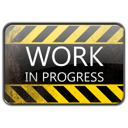

The `list-view` controller can render a list of components that are loaded lazily. It implements the following modes:

- paged
- stream
- full


**Client-side generated list of 500 components from inline JSON data**

The generated list consists of just 500 empty <code>div</code> containers that are later replaced with the
associated component, once they are about to become visible in the scroll area (lazy loaded components).

Components preload threshold can be adjusted using the [`zuix.lazyLoad(..)`](https://zuixjs.org/pages/documentation/api/zuix/Zuix/#lazyLoad) method.



```html

```



## Usage

<div class="mdl-tabs mdl-js-tabs mdl-js-ripple-effect">
  <div class="mdl-tabs__tab-bar" layout="row top-left">
      <a href="#module" class="mdl-tabs__tab is-active">Method #1</a>
      <a href="#script" class="mdl-tabs__tab">Method #2</a>
  </div>
  <div class="mdl-tabs__panel is-active" id="module">

### 1. Import `list-view` module

```html
<script type="module">
  import "{{ app.zkit.libraryPath }}controllers/list-view.module.js";
</script>
```

### 2. Add component

Add the `list-view` component:

```html
<list-view>
...
</list-view>
```

  </div>
  <div class="mdl-tabs__panel" id="script">




### 2. Load the `list-view` controller

Add the `ctrl z-load` attributes to the element hosting the *list-view*:

```html
<div ctrl z-load="{{ app.zkit.libraryPath }}controllers/list-view"
     z-context="my-list-view">
</div>
```

  </div>
</div>


## Option attributes

- `z-context="<context_id>"`
  identifier name to be used to access this component from JavaScript.
- `:on:<event_name>="<handler>"` <small>optional</small>  
  set handler function for event `<event_name>`




<strong>Full documentation and more examples will be soon available.</strong>



# Events

- TODO: ...


## Scripting

Get a reference to the component instance:

```js
zuix.context('my-list-view', (lv) => {
  // store a global reference for later use
  self.listView = lv;
});
```

### Methods

```js
// TODO: ...
```
